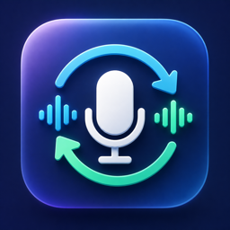

<p align="center">
  
</p>

# TranslaMic（译麦）

TranslaMic 是一款面向 Apple Silicon Mac 的开源实时语音翻译工具。它可以监听麦克风或指定应用的声音，使用 macOS 自带能力完成语音识别与翻译，再把目标语言语音送入虚拟麦克风，供腾讯会议、Zoom、Microsoft Teams 等会议软件作为麦克风使用。

除了“说一种语言、让会议软件听到另一种语言”，TranslaMic 还提供双语字幕、悬浮字幕、术语表和字幕记录。

> 当前版本：`0.2.0` 基本可用预览版。仅支持 macOS 26+ 和 Apple Silicon。核心的识别、翻译、MOSS 流式语音与虚拟麦克风链路已经可用；安装包尚未使用 Developer ID 签名或 Apple 公证，会议软件兼容性仍需逐项验证。

[English](README.md)

## 主要功能

- 实时识别麦克风或指定应用的声音。
- 使用 Apple Translation 在 Mac 本机生成目标语言文本。
- 将翻译结果朗读到 `TranslaMic Virtual Microphone`。
- 支持 macOS 系统语音和低延迟 MOSS-TTS-Nano 两种语音引擎。
- 显示原文、译文或双语悬浮字幕。
- 保存本次会话的字幕记录。
- 使用术语表改善人名、产品名和专业词汇的显示与翻译。
- 不需要 TranslaMic 账号，不包含分析或遥测。

## 工作原理

1. Apple Speech 在本机把输入音频转换成文字。
2. Apple Translation 在本机生成目标语言文本。
3. macOS 系统语音或本地 MOSS-TTS-Nano 把译文转换成语音。
4. Core Audio 虚拟驱动把语音提供给其他应用作为麦克风输入。

虚拟麦克风输出的是合成后的译文语音，不是原始麦克风声音。字幕通常会先出现，语音会因翻译和合成产生一定延迟。

## 系统要求

- macOS 26 或更高版本
- Apple Silicon（M 系列芯片）
- 安装驱动后能够重启 Mac
- 使用 MOSS-TTS-Nano 时，需要首次联网下载约 730 MB 模型权重
- 从源码构建时需要 Xcode 26 或更高版本

不支持 Intel Mac、macOS 25 及更早版本，也不计划发布到 Mac App Store。

## 安装

1. 从 GitHub Releases 下载 `translamic-x.y.z.pkg`。
2. 确认安装包来自可信的 TranslaMic 项目发布页面。
3. 安装 `.pkg`，然后重启 Mac，让 Core Audio 加载虚拟麦克风驱动。
4. 启动 TranslaMic，并按系统提示授予麦克风、语音识别和屏幕与系统音频录制等所需权限。

安装包会安装：

- `/Applications/TranslaMic.app`
- `/Library/Audio/Plug-Ins/HAL/TranslaMicVirtualAudio.driver`

### 未签名开发版说明

当前 `.pkg` 没有 Developer ID 签名，也没有 Apple 公证；应用和驱动只使用无需开发者账号的 ad-hoc 签名。macOS 可能阻止安装或首次打开。

请只安装可信来源的版本。若 macOS 阻止打开，可在“系统设置 → 隐私与安全性”中确认被阻止的应用确实是 TranslaMic 后再允许打开。未来稳定发行前将评估 Developer ID 签名与公证。

## 快速开始

### 1. 选择声音来源和语言

在“常规”设置中：

1. 选择麦克风或需要监听的应用。
2. 设置输入语言。
3. 设置字幕与翻译目标语言。
4. 如有需要，先下载 macOS 提示缺少的语音识别或翻译语言资源。

### 2. 设置翻译虚拟麦克风

1. 打开“朗读翻译结果到虚拟麦克风”。
2. 确认“翻译目标语言”正确。
3. 选择语音引擎和输出音色。
4. 在“测试文本”中输入一句话，点击“测试虚拟麦克风”。该按钮会直接从 Mac 扬声器播放，方便确认音色和发音。
5. 若状态显示驱动未加载，请先重启 Mac，再点击“刷新输入源”。

### 3. 设置会议软件

打开会议软件的音频设置，将麦克风选择为 **TranslaMic Virtual Microphone**。建议先使用会议软件自带的麦克风测试功能确认电平变化。

不要把 TranslaMic 自己的监听输入设置为 `TranslaMic Virtual Microphone`，否则可能形成循环或没有有效输入。

### 4. 开始翻译

点击 TranslaMic 的“开始”。讲话后，应用会依次完成识别、翻译、字幕显示和语音输出。结束会议时点击“停止”，需要时可打开“字幕记录”复制本次内容。

## 语音引擎

| 引擎 | 特点 | 适合场景 | 注意事项 |
| --- | --- | --- | --- |
| macOS 系统语音 | 启动快、延迟低、无需额外模型 | 实时会议、优先稳定性 | 自然度取决于已安装的系统音色 |
| MOSS-TTS-Nano ONNX | 低延迟本地合成，提供 17 个正常人声音色及跨语言音色迁移 | 实时会议、自然音色试听 | 首次下载约 730 MB 模型；使用 2 个 CPU 线程，缓冲 500ms 后开始连续播放 |

选择 MOSS-TTS-Nano 后，TranslaMic 会在后台准备隔离运行环境并下载固定版本的 ONNX 模型。界面在此过程中仍可操作。模型加载后会先进行一次无声预热，并由独立进程保持在内存中。每次仍以完整、已确认的翻译短句作为输入，但解码后的 PCM 会在缓冲 500ms 后持续送往扬声器或虚拟麦克风，不会按字符触发 TTS。

MOSS 运行文件保存在：

```text
~/Library/Application Support/TranslaMic/MossTTS
```

在 Apple M2 实测中，模型常驻后的英文和日语合成速度快于音频播放速度，并能在初始缓冲后开始出声。实际端到端延迟仍包含语音识别、短句确认和翻译时间；macOS 系统语音继续作为占用资源最低的兜底方案。

## 常见问题

### 会议软件看不到虚拟麦克风

- 安装 `.pkg` 后必须重启 Mac。
- 在 TranslaMic 中点击“刷新输入源”。
- 完全退出并重新打开会议软件，再检查麦克风列表。
- 确认驱动位于 `/Library/Audio/Plug-Ins/HAL/TranslaMicVirtualAudio.driver`。

### 点击测试按钮没有声音

- 测试按钮从 Mac 当前扬声器播放，而不是从会议软件播放。
- 检查系统音量、当前声音输出设备和测试文本是否为空。
- 确认目标语言与所选音色匹配。
- MOSS-TTS-Nano 必须等待状态变为“已就绪”后再测试。

### MOSS-TTS-Nano 长时间停留在下载或加载状态

- 首次需要下载约 730 MB 模型权重，并安装隔离运行环境；完成后总占用约 1.3 GB，请保持网络连接并预留至少 1.5 GB 空间。
- 模型下载完成后，首次加载仍需要一些时间。
- 若网络中断，重新选择 MOSS-TTS-Nano 或重启应用会继续检查并补全缺失文件。

### 有字幕但会议软件没有声音

- 确认已打开“朗读翻译结果到虚拟麦克风”。
- 确认会议软件选择的是 **TranslaMic Virtual Microphone**，而不是 Mac 内置麦克风。
- 使用会议软件的麦克风测试观察输入电平；虚拟麦克风不会自动从 Mac 扬声器回放。
- 确认 TranslaMic 会话正在运行，并且已经产生非空译文。

## 注意事项与已知限制

- 当前是基本可用预览版，核心链路已经通过本机测试；Zoom、Teams、腾讯会议及其他应用仍建议分别进行实机兼容性测试。
- 实时翻译必然存在延迟；MOSS-TTS-Nano 会在缓冲 500ms 后流式播放，但语音识别、短句确认和翻译完成后才能开始合成。
- 语音识别、翻译和合成结果可能有误，不应在医疗、法律、安全指令等高风险场景中作为唯一依据。
- 切换音色只影响后续生成的语音，不会修改已经输出的内容。
- 使用扬声器和外置麦克风时可能发生回声；会议中建议佩戴耳机。
- 更新应用时通常不需要重新下载 MOSS 模型，但更换模型版本时可能需要额外空间。
- 未签名版本适合开发和测试，不建议在无法确认安装包来源的设备上安装。

## 隐私与联网行为

TranslaMic 不需要账号，不包含项目方分析、遥测或云端后台。默认流程使用 macOS 的语音识别、翻译和系统语音能力；部分 Apple 语言资源可能需要由系统下载。

只有在用户选择 MOSS-TTS-Nano 时，应用才会联网下载隔离运行环境和固定版本的开源 ONNX 模型。之后的推理在本机完成。具体第三方说明见 `Sources/TranslaMicApp/Resources/MossTTS/THIRD_PARTY_NOTICES.md`。

## 从源码构建

```bash
git clone https://github.com/Techeek/translamic.git
cd translamic
/bin/bash ./scripts/prepare-moss-runtime.sh
xcodebuild -project TranslaMic.xcodeproj -scheme TranslaMic -configuration Debug build
```

生成唯一的未签名安装包时，构建脚本会自动准备 MOSS 运行器：

```bash
./scripts/build-pkg.sh 0.2.0
```

输出文件：`dist/translamic-0.2.0.pkg`。

## 致谢

特别感谢 [Frank Li（franklioxygen）](https://github.com/franklioxygen) 创建并开源 [v2s](https://github.com/franklioxygen/v2s)。TranslaMic 在 v2s 的实时语音识别、翻译、双语字幕和字幕记录等工作基础上继续开发，并增加了虚拟麦克风、目标语言语音输出及其他相关能力。没有原作者和社区贡献者提供的扎实基础，就不会有 TranslaMic。

## 许可证与来源

TranslaMic 采用 [MIT License](LICENSE) 开源，并基于 [franklioxygen/v2s](https://github.com/franklioxygen/v2s) 开发。虚拟音频驱动改编自 Apple 的“Creating an Audio Server Driver Plug-in”示例，许可声明见 `Drivers/TranslaMicVirtualAudio/APPLE_SAMPLE_LICENSE.txt`。MOSS-TTS-Nano、ONNX Runtime 与 uv 的说明见 `Sources/TranslaMicApp/Resources/MossTTS/THIRD_PARTY_NOTICES.md`。
